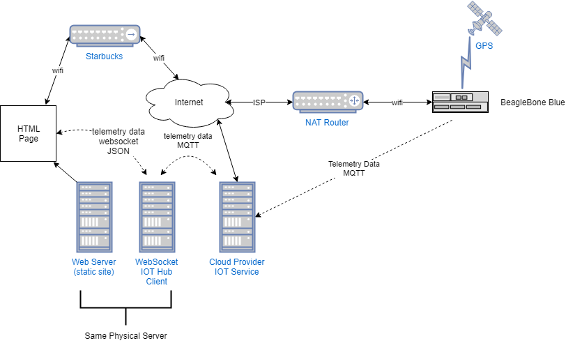

# Step 2 - Create a Client Side App

The setup I have so far is not complete. To get it to work, you have to run an application (in this case nodejs) on monitoring laptop to receive and display the data. 
I want to be able to just open a web page from anywhere and see the data.  

I pondered what architecture I would need. The web page should be dynamic, showing real time data, not a static one-shot. I occurred to me that 
using a web page that has a websocket client connection to a websocket server (running somewhere in the cloud) would work. The actual web page
could be served statically, and it would connect back to the websocket server to get real time updates. The websocket server would incorporate
the IoT Hub client side code from ReadDeviceToCloudMessages to receive the data.

So here is an updated architecture diagram:

 

## Turn the ReadDeviceToCloudMessages.js Into a Node Module

The ReadDeviceToCloudMessages.js file contains everything needed to receive the telemetry data from the IoT Hub. Now we need
to incorporate it into a web socket server. First thing is to modify that file to be a nodejs module. I chose to 
export its functionality as a class. Most of the code is exactly the same with some class scaffolding. 

I hit one hiccup when I first implemented the class version on a computer that was running nodejs version 12. One version supports 
a newer method of defining class methods using arrow function syntax. You can do this:

```javascript
class XYZ {
  ...

  myMethod = () => {
    ...
  }
}
```

That syntax is nice because it autobinds myMethod to the XYZ 'this', just like normal arrow functions. Unfortunately for me, I committed
this code to my repo and then downloaded it to a different machine running nodejs version 10. It immediately barfed all over that
code with syntax errors. It took me a minute to figure that out. So I changed the methods back to the conventional format, but then I
had a bunch of incorrect 'this' problems that took me another minute to figure out. I was getting errors from the innards of
the Azure IoT functions that didn't make sense. So I debugged and saw the callbacks had the wrong this. I changed my methods to 
bind them properly in the class constructor. I felt like I needed this to be portable to not require the latest JavaScript syntax.

Anyway, here is what I ended up with for the class version (renamed to TelemetryReceiver.js). 

```javascript
// Copyright (c) Microsoft. All rights reserved.
// Licensed under the MIT license. See LICENSE file in the project root for full license information.

"use strict";

// Using the Node.js SDK for Azure Event hubs:
//   https://github.com/Azure/azure-event-hubs-node
// The sample connects to an IoT hub's Event Hubs-compatible endpoint
// to read messages sent from a device.
const { EventHubClient, EventPosition } = require("@azure/event-hubs");

class TelemetryReceiver {
  // Connection string for the IoT Hub service
  //
  // NOTE:
  // For simplicity, this sample sets the connection string in code.
  // In a production environment, the recommended approach is to use
  // an environment variable to make it available to your application
  // or use an x509 certificate.
  // https://docs.microsoft.com/azure/iot-hub/iot-hub-devguide-security
  //
  // Using the Azure CLI:
  // az iot hub show-connection-string --hub-name {YourIoTHubName} --output table
  constructor(connstring) {
    this.connectionString = connstring;
    this.data = {"temperature":0,"humidity":0};
    // bind member functions for use in async code
    this.update       = this.update.bind(this);
    this.printError   = this.printError.bind(this);
    this.printMessage = this.printMessage.bind(this);
  }

  /**
   * The input data is stored in this.data and 
   * users of this module can poll for the latest
   * data. For a first cut this was easier than
   * implementing a client callback.
   * @return current telemetry data
   */
  getTelemetry () {
    return this.data;
  }

  /**
   * store the latest telemetry data in this.data
   */
  update (message) {
    console.log(message.body);
    this.data = message.body;
  }

  /**
   * print error messages
   */
  printError (err) {
    console.log(err.message);
  }

  /**
  // Display the message content - telemetry and properties.
   * Telemetry is sent in the message body
   * The device can add arbitrary application properties to the message
   * IoT Hub adds system properties, such as Device Id, to the message.
   */
  printMessage (message) {
    console.log("Telemetry received: ");
    console.log(JSON.stringify(message.body));
    console.log("Application properties (set by device): ");
    console.log(JSON.stringify(message.applicationProperties));
    console.log("System properties (set by IoT Hub): ");
    console.log(JSON.stringify(message.annotations));
    console.log("");
  }

  /**
   * The client application calls 'run' once to get the client running. From
   * there is continues to receive data until the app is closed.
   * Connect to the partitions on the IoT Hub's Event Hubs-compatible endpoint.
   * This example only reads messages sent after this application started.
   */
  run () {
    let ehClient;
    EventHubClient.createFromIotHubConnectionString(
      this.connectionString
    )
      .then((client) => {
        console.log(
          "Successully created the EventHub Client from iothub connection string."
        );
        ehClient = client;
        return ehClient.getPartitionIds();
      })
      .then((ids) => {
        console.log("The partition ids are: ", ids);
        return ids.map((id) => {
          // here is where the wrong 'this' binding was showing up
          // when these callbacks were made with the ehClient this
          return ehClient.receive(id, this.update, this.printError, {
            eventPosition: EventPosition.fromEnqueuedTime(Date.now())
          });
        });
      })
      .catch(this.printError);
  }
}

module.exports = TelemetryReceiver;
```


Go to [Step 3](../step3/README.md).