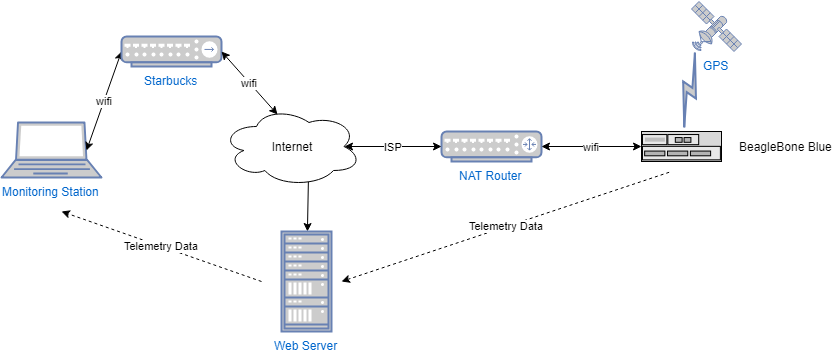
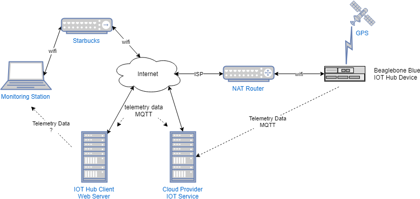

IOT Telemetry : Azure and AWS
----------------------------------

Using an IOT device with some sensors on it, I want to be able to monitor them in real time
from anywhere I have cellular or wifi access, and send commands to the device. The purpose of this experiment is to see what pieces, software and hardware, 
that need to be in the solution to get it to work. (Not necessarily that the result will be particularly useful)

For this attempt, I have several devices that I can use at the IOT Device : a Beaglebone Black, a Beaglebone Blue, a couple of Raspberry PI's and
my development workstation. I have a USB GPS I can install on any of these and get position data via the USB serial port it provides. 
It will be somewhere it can connect to wifi (no cellular modem on this one) to potentially uplink its location. Ideally it would be battery powered
and have a cellular modem so I could throw it on a vehicle or a person and monitor what they are doing,  but for this
round I just want to get see the telemetry data remotely. I guess I could strap it to my dog and detect if is 
sleeping or running around the house. 

# Assumptions
 - the IOT device is behind a NAT router so it can't be accessed directly from the internet
 - the IOT device will provide telemetry of its GPS position (lat,lon,velocity, time, etc)
 - the monitoring station laptop will be on whatever wifi it has available
 - a web server will be located somewhere on the public internet that can serve the app that monitors the device
 - the web server backend will be able to get the data from the device, somehow
 - the data will be shown in real time, with a reasonable latency (a small number of seconds at the most)
 

# Functional Requirements and Design

- the IOT device runs Linux or Window
- the IOT device software should be portable to any of my platforms
- the IOT device app will be implemented with nodejs for portability
- the web server back end will use nodejs
- the web front end will be a very simple web page that displays the data in real time.
- the monitoring device is anything with a modern browser
- because the IOT device is behind a NAT router, it must initiate the connection to the backend web server
- the connection from laptop to web server will be secured
  - HTTPS or other encrypted protocol will be used
  - access to the monitoring app will be restricted to authorized users
- the connection from the IOT device to the web server backend will be secured
  - access to the web server backend will be restricted to the IOT device only (protected from unauthorized connections)

# Software Approach

There are 3 apps in the system : the IOT device telemetry app, the web server backend and the front end app.

## Homegrown
   
  All apps in the system will be built from the ground up. Just have some HTTP connections between the components and
  send data as needed. 
   - advantage : simple-ish to implement. nothing new to learn
   - disadvantages:
     - hard to secure (if only because security is hard to get right)
     - hard to scale

## IOT Cloud Service
   
  All three of the major could providers, Amazone AWS, Google Cloud and Microsoft Azure have 
  support for IOT devices. Their facilities are fairly similar but there is a bit of difference
  in how much there is to learn and how complex the implementation is.
  - advantages :
    - scalable to millions of devices
    - built-in security (assuming they know more about it than I do)
  - disadvangages:
    - a bit more complex (edit: turns out to be pretty easy for this simple use case)
    - a lot to learn

## New Design

I decided to attempt to use a Cloud IOT service due to better security  and scalability. I also becuase
I wanted to learn about them.  An extra piece, the Cloud IOT service is added to the mix. In the original design, the IOT device and web
server talk to each other directly. In the new design, each end talks via the Cloud IOT service, which adds a boatload
of functionality that would a lot of work to duplication.

With either Azure IOT or AWS IOT, my design is the same. The underlying implementation is different. Ideally, I could
structure my application to work with either service, perhaps with a library I write that supports both systems.

Here is a modified design diagram including the Cloud IOT support:

 

# Building the Solution

I prefer to develop incrementally, especially when I'm learning a new technology. I experiment with
the new stuff until I feel I know how it works then I put the pieces together one-by-one to get the full solution.
This is a bottom up approach. Then once I understand what the individual components can and should do, I can
continue with a top down implementation.
In this case I do the hard part first, which is learning Azure IOT and getting the device communicating. I could 
have mocked up the web front end and the Node backend first and then worked to get the back end talking to the 
IOT device via Azure. If you had a team of more than one this would have been a good way to split things up.

# Azure

I will start with Azure. 

## Step 1 - Azure IOT device sending and Workstation Receiving Telemetry

This involves basic setup of the Azure IOT device side support, and then getting the Beaglebone to uplink telemetry to the Azure service. 
At this point I will use fake data to keep it simple. BTW, you don't really need a physical IOT device, you can work through most of
this using your workstation as your device.

Go to [Step 1](Azure/step1/README.md). During the setup you will be following a tutorial on the Azure website, but the step 1 readme has some extra information and 
hints that can help out when doing the tutorial.

## Step 2 - Azure Sending Commands to the IOT Device

Now that the IOT device is sending its data to Azure, and I can read it from my workstation,  I need to see how to send commands to the device.

Go to [Step 2](Azure/step2/README.md). You will be following the next step in the Azure IOT tutorial.

## Step 3 - IOT Device Application

Go to [Step 3](Azure/step3/README.md).  Create the actual application to run on the IOT device. 

## Step 4 - Web Server Backend

Go to [Step 4](Azure/step4/README.md).  Creating the web server backend that reads the IOT device telemetry and forwards commands to it.to run on the IOT device. 

## Step 5 - Web Frontend

Go to [Step 5](Azure/step5/README.md). Create the web app  

# AWS

# Comparison and Conclusions